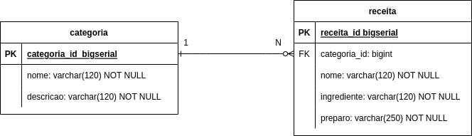

# Projeto  - Módulo 2
## LabFood
### Sobre o Projeto

Uma empresa especializada em desenvolvimento de aplicações deseja desenvolver
uma aplicação para controle de receitas online **LabFood**.

### Descrição
Aplicação construinda com a linguagem **java** utilizando o framework **Spring**
com a seguintes dependências: **Spring Web, Spring Data JPA, Lombok, PostgreSQL Driver**

### modelo relacional
A aplicação tera uma base de dados com duas tabelas “categoria” “receita”
que receberá os seguintes modelo relacional



### Tecnologias Utilizadas

- Java
- Spring
- JPA
- Maven
- PostgreSQL

### Como executar o Projeto
#### Pré Requisito: Java 17

- clonar repositório:
  https://github.com/RentonAires/labfood
- Importar o projeto na IDE de sua preferência:
- configurar a variável de ambiente:
    - spring.datasource.url
    - spring.datasource.username
    - spring.datasource.password
- Exercutar a aplicação:
 
    
    
  
#### Endpoints

**GET** `/categoria`
```JSON
{
  "id": 1,
  "nome": "gluten",
  "descricao": "esse receita contém gluten"
}
```
**GET** `/receita`
```JSON
{
  "id": 1,
  "nome": "recaita de bolo",
  "ingrediente": "2 xícaras (chá) de açúcar, 4 colheres (sopa) de margarina, 1 e 1/2 xícara (chá) de leite, 3 xícaras (chá) de farinha de trigo, 3 ovos, 1 colher (sopa) bem cheia de fermento em pó ",
  "preparo": "Essa é a parte do texto na qual haverá uma explicação, mais detalhada possível, sobre como a receita deve ser executada"
}
```

## Autor
### Renato Aires

[Linkedin](https://www.linkedin.com/in/renato-aires-5128b7189/)

[Github](https://github.com/RentonAires)
